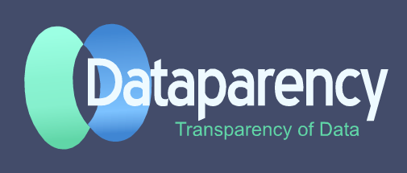

## Welcome to Dataparency Developer Pages
[Website](https://dataparency-dev.github.io/)

Dataparency's Distributed Data Network / Information Sharing Platform&trade; is an Entity-centric, Entity-bound, and Entity-controlled NoSQL distributed database providing access control, security, and a 'schema agnostic' data model. 

It is highly scalable as data can be sharded by entity. Combined with FaaS like AWS Lambda, it can support thousands to millions of accesses per second. 
It is appropriate for use cases where privacy and security are an essential need for compliance with standards such as GDPR and CCPA.
Reference the whitepaper for further details.

&copy; Copyright 2022 Dataparency, LLC. All rights reserved. Dataparency&trade;, Dataparency Distributed Data Network&trade;, Dataparency Information Sharing Platform&trade; and D-ISP&trade; are trademarks of Dataparency, LLC

